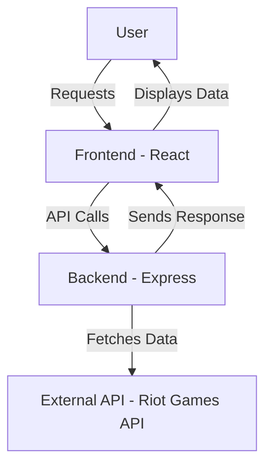

<h1>Main Architecture</h1>

```mermaid
graph TD;
    A[User] -->|Requests| B[Frontend - React]
    B -->|API Calls| C[Backend - Express]
    C -->|Fetches Data| D[External API - Riot Games API]
    C -->|Sends Response| B
    B -->|Displays Data| A
```

